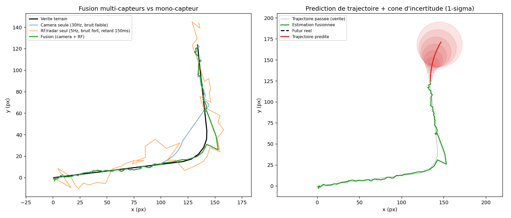
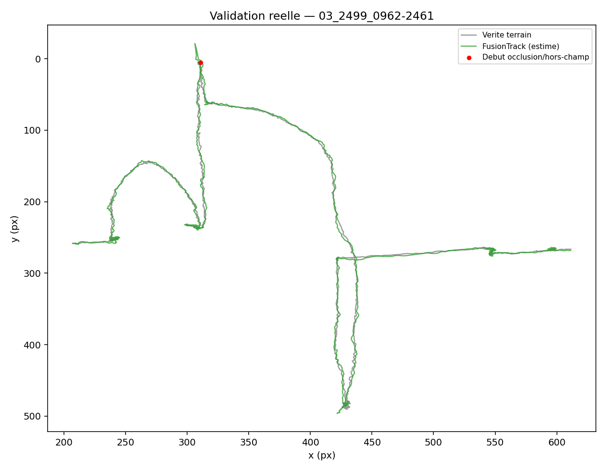

# 🎯 Shahed Detection System — Multi-Sensor Fusion Edition

<div align="center">


**YOLOv8 real-time drone detection · Multi-sensor Kalman fusion tracking · PDF report · KML export**

*Système de détection et de suivi temps réel de drones Shahed-136 par IA — développé par [alexandre196](https://github.com/alexandre196)*

</div>

---

## 🆕 What's new in this fork — Sensor Fusion

This repository extends the original [`Drone_Shaed_AI`](https://github.com/alexandre196/Drone_Shaed_AI) with a rewritten tracking core (`sensor_fusion.py`), moving from a single-sensor constant-velocity Kalman filter to a **multi-sensor, constant-acceleration fusion tracker**:

| | Original tracker | Fusion tracker |
|---|---|---|
| Motion model | Constant velocity `[x,y,vx,vy]` | **Constant acceleration** `[x,y,vx,vy,ax,ay]` — tracks turns and maneuvers, not just straight lines |
| Sensors | Camera (YOLO) only | Camera **+ pluggable second sensor** (RF, radar, second camera) via `add_external_measurement()` |
| Timing | Implicit (1 update = 1 frame) | **Explicit timestamps (seconds)** — robust to variable FPS / frame-skip |
| Async / late measurements | Not handled | **Out-of-sequence measurement handling** — rewinds and replays filter history when a slower sensor's reading arrives late |
| Forward prediction | Frame-by-frame only | `predict_trajectory(horizon_s)` — projects several seconds ahead with a **growing uncertainty cone** |

### Why it matters

A single visual sensor loses the target during occlusion, glare, or a sharp turn — the exact moment tracking matters most. In a controlled two-sensor simulation (30Hz low-noise camera with a 1.8s dropout during a turn, fused with a 5Hz higher-noise RF-style sensor at 150ms latency):

| Track | RMSE vs ground truth |
|---|---|
| Camera only | 5.47 px |
| RF/radar only | 14.06 px |
| **Fused** | **3.36 px** |

The fusion track stays locked on the true trajectory through the dropout window instead of drifting or freezing:



> Left: camera-only tracking loses the target during the dropout (turn), while the fused track (camera + RF) stays on course. Right: trajectory prediction with growing 1-σ uncertainty ellipse. Full reproducible scenario in [`simulate_fusion_demo.py`](simulate_fusion_demo.py).

### Architecture of `sensor_fusion.py`

```
Measurement(t, x, y, R, sensor_id)
        │
        ▼
FusionTrack  ── predict(t) ──────► state propagated to any timestamp (CA model)
        │
        ├── fuse(measurement) ───► standard KF update if measurement is current
        │
        ├── fuse(late measurement) ─► rewind to nearest checkpoint,
        │                             replay all measurements in
        │                             chronological order (OOSM handling)
        │
        └── predict_trajectory(horizon_s) ─► future path + 1-σ uncertainty ellipse
```

Integrated into the existing `DroneTracker` class (`drone_shahed_detector.py`) — same public API (`track()`, trail, IDs), so the GUI, CSV/KML export and PDF report all work unchanged.

---

## 🚀 Features

- ✅ **YOLOv8s fine-tuned** on Shahed dataset — mAP@50 = **99.5% on Shahed class** (89.4% global)
- ✅ **Multi-class classifier** : `bird` / `not` / `shahed` — optimized to minimize false positives
- ✅ **Multi-sensor Kalman fusion tracking** — constant-acceleration model, out-of-sequence measurement handling, persistent drone ID, trajectory trail, velocity & direction
- ✅ **Trajectory prediction with uncertainty cone** — project the estimated future path several seconds ahead
- ✅ **Behavioral analysis** — hovering, circling, fast approach, erratic motion detection
- ✅ **GPS-free geolocalization** — monocular distance + camera-heading-aware azimuth → lat/lon
- ✅ **Live radar mini-map** — real-time position display in GUI
- ✅ **3 input sources** — video file / webcam / RTSP IP camera (FLIR, Hikvision, Axis...)
- ✅ **Automated alerts** — audio alarm + email (Gmail SMTP) + push notification (Ntfy)
- ✅ **KML export** — Google Earth trajectory with geolocalized pins
- ✅ **CSV export** — for QGIS and GIS tools
- ✅ **Automated PDF report** — stats, charts, radar map, closest threat image
- ✅ **Temporal confirmation filter** — N consecutive frames before alarm (anti false-positive)
- ✅ **Configurable danger zone** — adjustable threshold in meters (default 300m)
- ✅ **Cross-platform** — Windows & macOS

---

## 📊 Model Performance (v2 — fine-tuned)

| Class | mAP@50 | mAP@50-95 |
|-------|--------|-----------|
| **shahed** | **99.5%** | 84.3% |
| bird | 83.9% | 52.1% |
| not | 86.3% | 57.9% |
| **ALL** | **89.4%** | 64.8% |

> Model v2 fine-tuned on 16,069 images including top-view, side-view and **bottom-view** Shahed-136 footage.
> Training: 50 epochs · RTX 4070 Ti · 1h54

---

## ⚙️ Installation

```bash
pip install -r requirements.txt
```

**Optional (audio alarm on Windows):**
```bash
winget install ffmpeg
```

**Optional (audio alarm on macOS):**
```bash
brew install ffmpeg
```

---

## 🚀 Usage

```bash
python drone_shahed_detector.py
```

1. Select your video source — **File / Webcam / RTSP stream**
2. Load the model (`runs/detect/shahed_detector/weights/best.pt`)
3. Set your camera GPS position, FOV, heading
4. Configure danger distance threshold (meters)
5. Click **LANCER LA DÉTECTION**

To run the standalone fusion demo (no video/model required):

```bash
python simulate_fusion_demo.py
```

---

## 📁 Project Structure

```
Drone-Shahed-AI-Multi-Sensor-Tracker/
├── drone_shahed_detector.py   # Main detection system (GUI + pipeline)
├── sensor_fusion.py           # Multi-sensor Kalman fusion tracker (CA model, OOSM, prediction)
├── simulate_fusion_demo.py    # Standalone reproducible fusion vs single-sensor benchmark
├── validate_against_antiuav410_REAL.py  # Validation against real Anti-UAV410 footage
├── entrainement_v2.py         # Fine-tuning script (transfer learning)
├── Annotate_dessous.py        # Manual annotation tool (YOLO format)
├── train_shahed.py            # Initial training script
├── download_shahed_dataset.py # Dataset download helper
├── chiffres.py                # Statistics utility
└── README.md
```

---

## 🧠 Architecture

```
Camera / Video / RTSP  ──┐
                          ├──►  Multi-Sensor Kalman Fusion Tracker
Optional 2nd sensor ─────┘        (constant-acceleration model,
(RF / radar / 2nd camera)          async / out-of-sequence handling)
                                          │
                                          ▼
                                Behavioral Analysis
                                          │
                                          ▼
                                GPS-Free Geolocalization
                                          │
                                          ▼
                                Alert Pipeline (audio + email + push)
                                          │
                                          ▼
                                KML / CSV / PDF Export
```

---

## 🗂️ Model Classes

| Index | Class | Description |
|-------|-------|-------------|
| 0 | `bird` | Birds — neutral, no alarm |
| 1 | `not` | Other objects — neutral |
| 2 | `shahed` | Shahed-136 kamikaze drone — **DANGER** |

---

## 📍 Geolocalization

The system estimates drone position **without GPS** using:
- Per-class real wingspan (Shahed-136 = **2.5m**)
- Camera FOV + auto-computed focal length
- Camera heading (0=North, 90=East, 180=South, 270=West)
- Pixel position → azimuth → lat/lon offset

Positions are exported as **KML** (Google Earth) and **CSV** (QGIS).

---

## 🔔 Alert Pipeline

| Trigger | Action |
|---------|--------|
| Shahed detected | Audio alarm |
| Distance < threshold | Email with drone image |
| Confirmed N frames | Ntfy push notification |
| End of analysis | Automated PDF report |

---

## 🧪 Validation

The fusion tracker's behavior under sensor dropout and asynchronous measurements is validated in [`simulate_fusion_demo.py`](simulate_fusion_demo.py) against a simulated maneuvering target with a controlled camera dropout window, and against real annotated drone footage from the [Anti-UAV410](https://github.com/HwangBo94/Anti-UAV410) benchmark — see the Validation on real footage section above.

---

## ✅ Validation on real footage — Anti-UAV410 benchmark

Beyond the synthetic dropout scenario above, `FusionTrack` was validated against three real annotated sequences from the [Anti-UAV410](https://github.com/HwangBo94/Anti-UAV410) benchmark (thermal infrared, ground-truth bounding boxes per frame). Ground-truth positions were fed as simulated camera detections (with realistic measurement noise) to isolate tracker performance from detector performance.

| Sequence | Frames | Normal RMSE | Fast-motion RMSE | Post-occlusion RMSE |
|---|---|---|---|---|
| `03_3780_0001-1499` | 1500 | 3.29 px | 14.93 px (20 frames) | — (no real occlusion) |
| `02_6319_1500-2999` | 1500 | 3.10 px | 6.19 px (77 frames) | — (no real occlusion) |
| `03_2499_0962-2461` | 1500 | 2.49 px | 3.98 px (60 frames) | **10.10 px** (11-frame real occlusion) |



Fast-motion frames are derived automatically (speed > mean + 2σ within the sequence), not from the dataset's sequence-level attribute tags, since those tags describe whole sequences rather than individual frames. Reproduce with:

```bash
python validate_against_antiuav410_REAL.py --seq /path/to/AntiUAV410/test/03_2499_0962-2461 --fps 30
```

**Takeaway:** normal-flight accuracy is sub-3px across all three sequences; error grows measurably during fast maneuvers (constant-acceleration model reacting with some lag) and during dead-reckoning through a real occlusion, but the track re-acquires cleanly rather than diverging — consistent with the synthetic benchmark above.

---

This is a portfolio / R&D project demonstrating an end-to-end detection-tracking-alerting pipeline — not a certified operational counter-drone system. Being explicit about scope:

- **Monocular distance estimation** — distance is inferred from `(known real width × focal length) / pixel width`, a standard technique but sensitive to non-frontal viewing angles, FOV miscalibration, and lighting. It is not true ranging (no stereo, radar, or LIDAR).
- **Detection accuracy in the field will be lower than the reported mAP@50 (99.5%)** — that number reflects performance on a validation set drawn from conditions similar to training. Robustness to night, rain, backlight, or unseen altitudes/angles has not been benchmarked.
- **Single RGB sensor** — the fusion tracker (`sensor_fusion.py`) is architected to accept a second sensor (RF, radar, IR) via `add_external_measurement()`, but has only been validated with camera-only input and a simulated second sensor. Real multi-sensor hardware integration is future work.
- **No adversarial or hostile-environment testing** — no measured false-positive/false-negative rate on real-world footage, no jamming resistance testing, no degraded-latency benchmarking.

These are the same constraints faced by any single-camera detection system; a production counter-UAS system would require certified sensor fusion (radar/RF/acoustic), adversarial testing, and field validation well beyond the scope of this project.

---

## 📄 License

GPL-3.0 — see [LICENSE](LICENSE)

---

## 👤 Author

**Alexandre Martin** — AM Consulting, France
[GitHub](https://github.com/alexandre196) · [Website](https://www.amconsulting-formation.com)

> *An end-to-end exploration of real-time detection, multi-sensor tracking, and geolocation — built to learn, and to show the work.*
